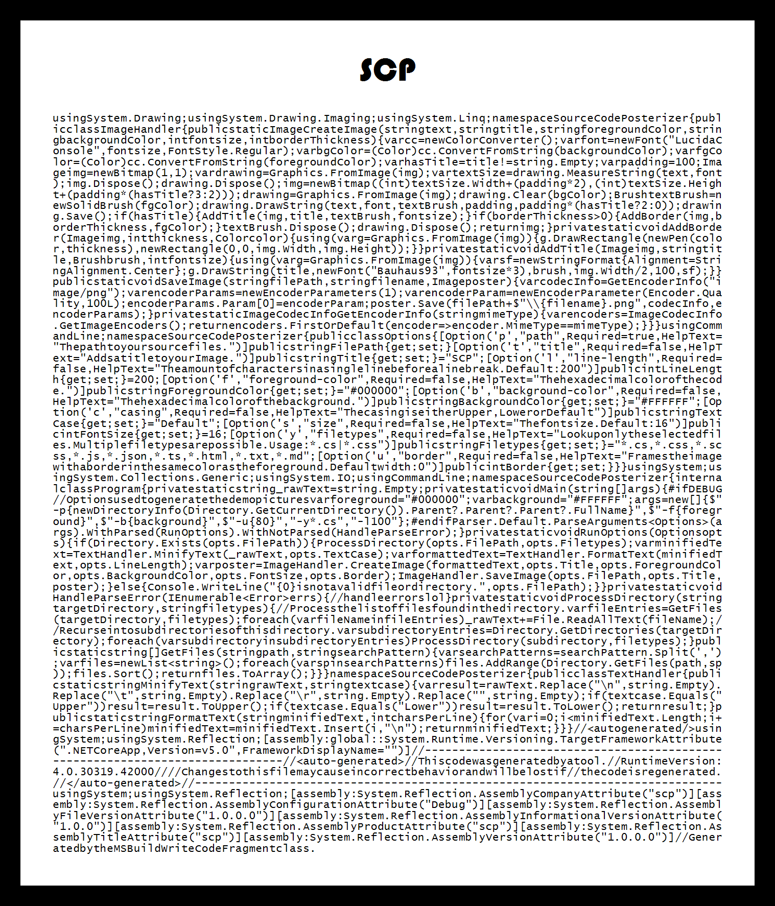
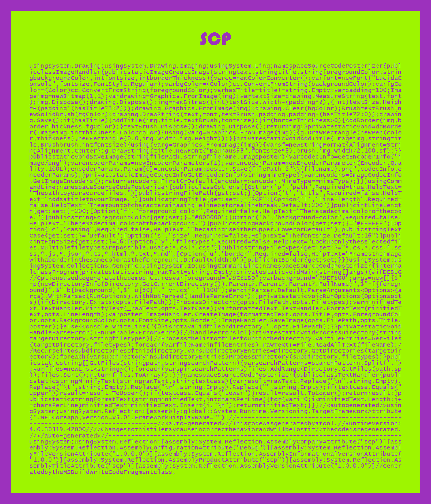
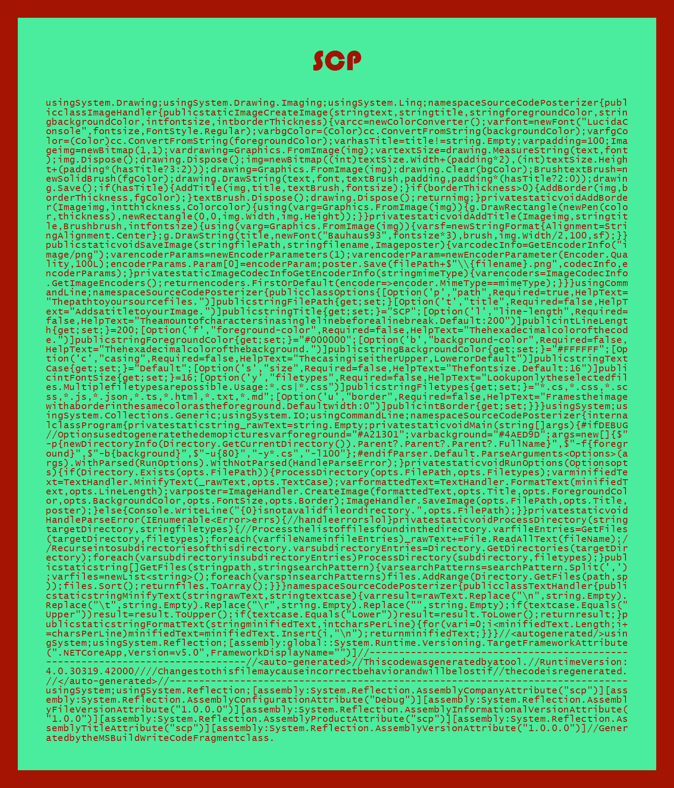
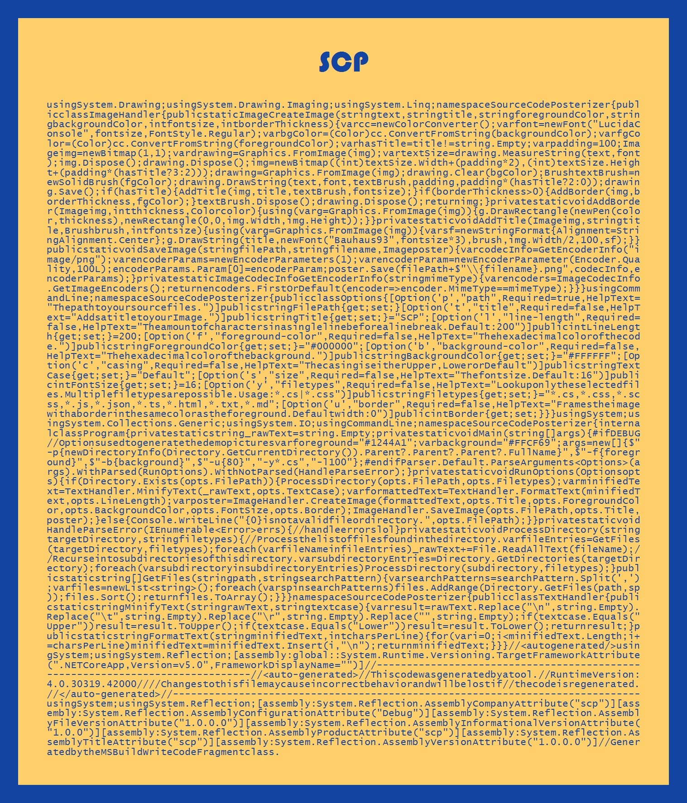

# Source Code Posterizer
Generate Images from your Code

## Description
I got bored and thought "Maybe I want to print out my code and make a poster out of it?"  
This CLI will take all files (with restrictions) from a path, minifies them and generates an image.

## Basic usage
Search all files (according to the set filter) and create an image named "SCP.png" in the `<DIRECTORY>`
```
scp -p <DIRECTORY>
```
You can lock the aspect ratio to 1:414 if you want generate an image you can easily print. As a side-effect, your text can overflow on the y-axis or leave a blank space. Simply increase or decrease the characters per line to manually fit everything into the frame   
```
scp -p <DIRECTORY> -l 150 -u 80 -t SCP
```
Example output (locked aspect ratio):  
  

## Advanced usage
Create an image with different colors, 100 characters per line, 80 pixel border and the title "SCP"
```
scp -p <DIRECTORY> -f #FFFFFF -b #000000 -l 100 -u 80 -t SCP
```
Example outputs (unlocked aspect ratio:  







## Options
Note: The width of the image directly corresponds with the amount of characters and the resulting string width.
Depending on the amount of code, you might want to change the Fontsize or LineLength to get the right aspect ratio for your image.

Short Name | Long Name | Default
--- | --- | ---
`-p` | `--path` | None, this is the only required field.
`-t` | `--title` | SCP
`-l` | `--line-length` | 200
`-f` | `--foreground-color` | #000000
`-b` | `--background-color` | #FFFFFF
`-c` | `--casing` | Default
`-s` | `--size` | 16
`-y` | `--filetypes` | *.cs,*.css,*.scss,*.js,*.json,*.ts,*.html,*.txt,*.md
`-u` | `--border` | 0
`-a` | `--lock-aspect`| false

## Build your own release package
Standard `dotnet` buildscripts apply.  
For example, if you want to build a self-contained release with NET 5:  
```
dotnet publish -r win-x64 -c Release -o publish -p:PublishReadyToRun=true -p:PublishSingleFile=true -p:PublishTrimmed=true --self-contained true -p:IncludeNativeLibrariesForSelfExtract=true
```
