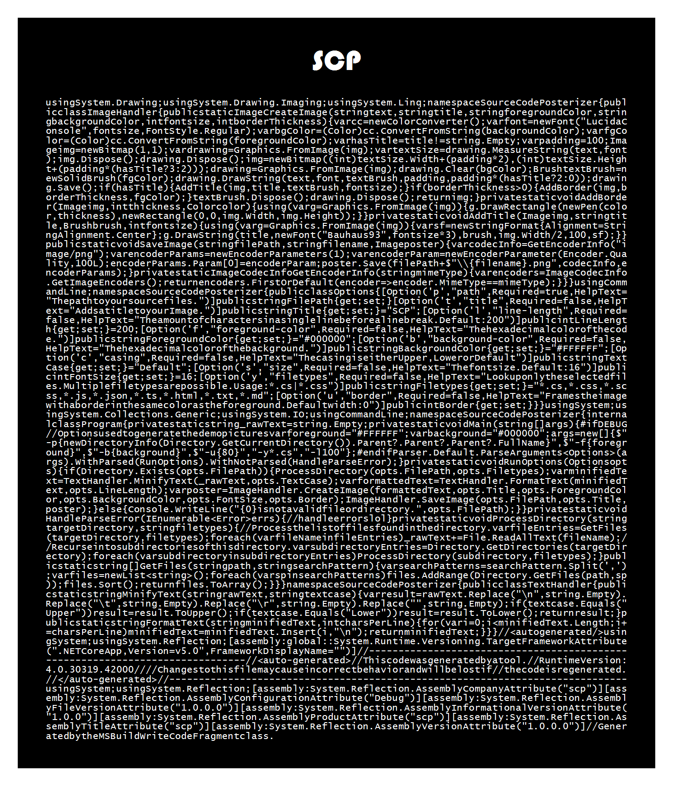

# Source Code Posterizer
Generate Images from your Code

## Description
I got bored and thought "Maybe I want to print out my code and make a poster out of it?"  
This CLI will take all files (with restrictions) from a path, minifies them and generates an image.

## Basic usage
Search all files (according to the set filter) and create an image named "SCP.png" in the `<DIRECTORY>`
```
scp -p <DIRECTORY>
```
## Advanced usage
Create an image with different colors, a title and a border
```
scp -p <DIRECTORY> -f #FFFFFF -b #000000 -l 100 -u 80 -t SCP
```
Example outputs:  



## Options
Note: The width of the image directly corresponds with the amount of characters and the resulting string width.
Depending on the amount of code, you might want to change the Fontsize or LineLength to get the right aspect ratio for your image.

Short Name | Long Name | Default
--- | --- | ---
`-p` | `--path` | None, this is the only required field.
`-t` | `--title` | SCP
`-l` | `--line-length` | 200
`-f` | `--foreground-color` | #000000
`-b` | `--background-color` | #FFFFFF
`-c` | `--casing` | Default
`-s` | `--size` | 16
`-y` | `--filetypes` | *.cs,*.css,*.scss,*.js,*.json,*.ts,*.html,*.txt,*.md
`-u` | `--border` | 0
